# シフト管理システム

アルバイト先の飲食店の業務を効率化するためのWebアプリケーションです。  
シフト管理、シフト希望提出などを一元化しています。

社員との話し合いも行い、実際に店舗に導入し、運用する予定です。

---

## 技術スタック

- Frontend: JavaScript React
- Backend: Python FastAPI
- Database: PostgreSQL
- Authentication: JWT
- ORM: SQLAlchemy

---

## 機能一覧

### ユーザー機能
- ユーザー登録申請
- 登録申請の許可　/ 却下
- ログイン / ログアウト（JWT認証）
- 権限制御（管理者 / スタッフ）

### 業務関連
- シフト希望の提出
- シフト確認

↓（管理者機能）
- シフト登録
- シフト提出の期間を管理
- ユーザー管理

---

## 工夫した点

- JWT認証を用いたログイン機能を実装し、安全な認証・認可を実現
- 管理者とスタッフで利用できる機能を制限し、権限管理を実装
- データベースに保存する情報を必要最小限に抑え、保守性を考慮
- バックエンドとフロントエンド間でやり取りするデータを整理し、API設計を最適化
- モジュール間の依存を抑えた疎結合な設計を採用
- 機能追加や仕様変更に対応しやすい拡張性の高い設計を意識
- スタッフや社員へのヒアリングを行い、現場で使いやすいUI・操作性を追求

---

## 詳細

- ログイン画面

ユーザーネームとパスワードを入力してログインできます。

  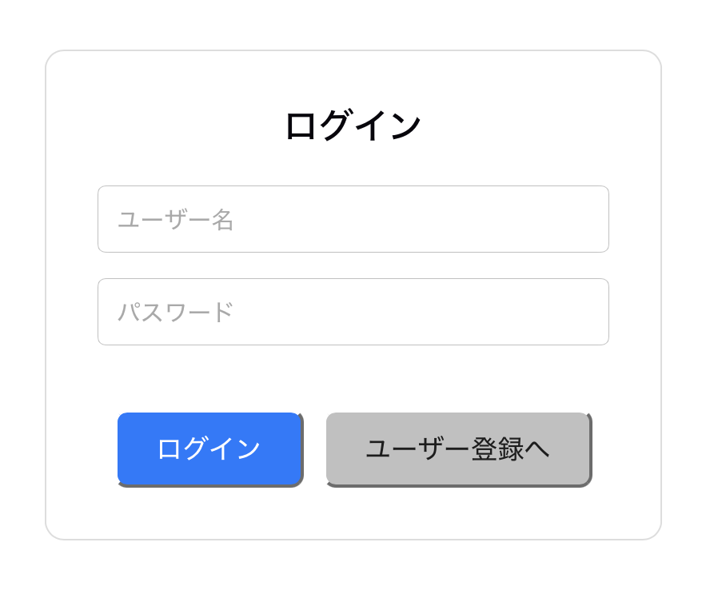

- ユーザー登録申請

ユーザー名とパスワードを設定して、ユーザー登録申請を行うことができます。  
この時点では、管理者に登録申請が送信されるだけで、実際に登録はされません。

  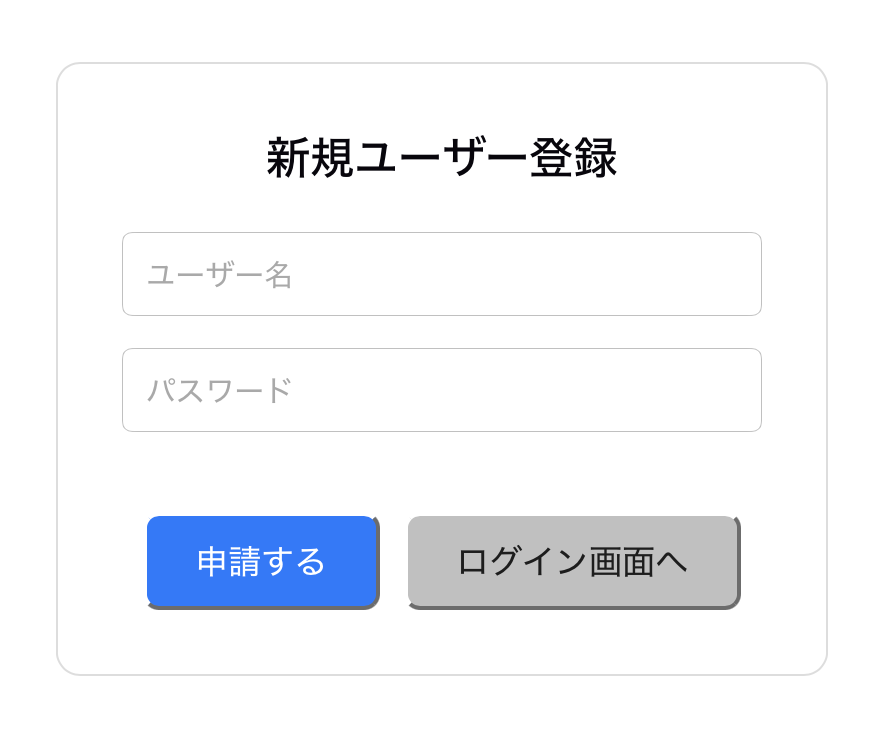

- 管理者画面・スタッフ画面

管理者用の機能は「シフト期間の設定」「シフト登録」「ユーザー管理」「ユーザー登録申請の管理」です。
スタッフ用の機能は「シフト希望の提出」「シフト確認」です。

<table>
  <tr>
    <td valign="top">
      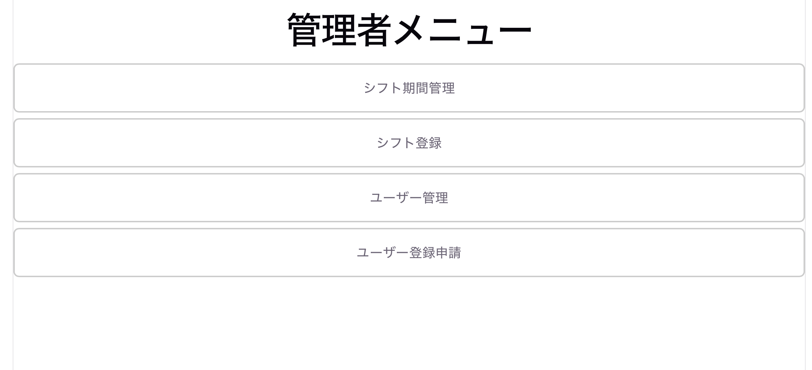
    </td>
    <td valign="top">
      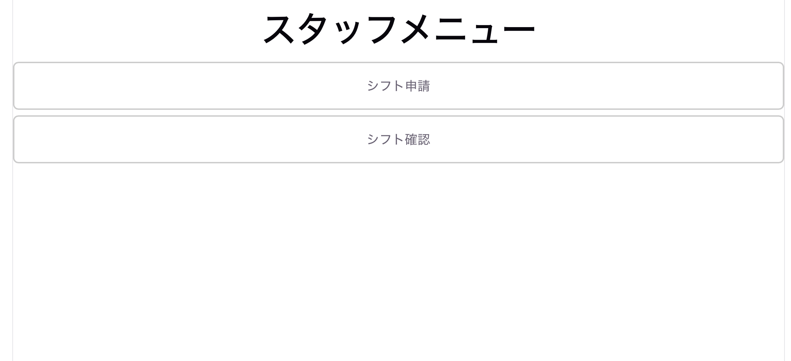
    </td>
  </tr>
</table>

- シフト期間の設定（管理者機能）

シフト登録の期間を更新できます。シフト登録期間の開始日と終了日を選択した上で、その期間内の営業日を選択できます。
スタッフは、ここで設定された期間のシフト希望を提出できるようになります。

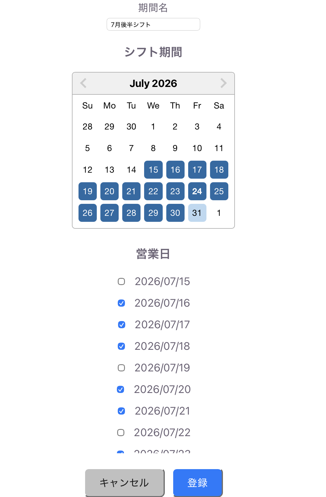

- シフト登録（管理者機能）

スタッフから送られてきたシフト希望を参照しながら、シフトを登録することができます。ここで登録したシフトは、スタッフも閲覧できるようになります。

 

まず、「希望を取得」ボタンを押すと、スタッフからのシフト希望が反映されます。そして、各日付ごとにメンバーや備考を保存し、最後に「登録」ボタンを押すことで、期間内のシフトをまとめて登録します。

### シフト表

  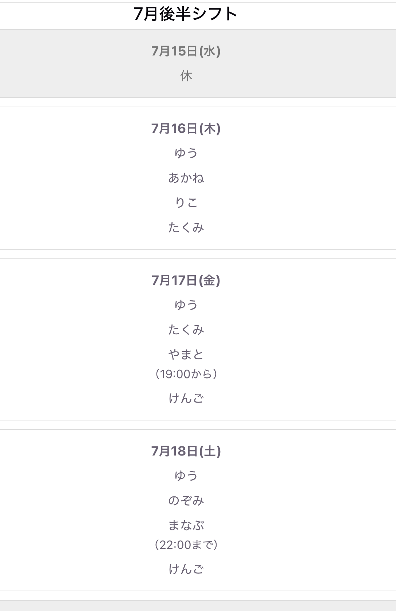
  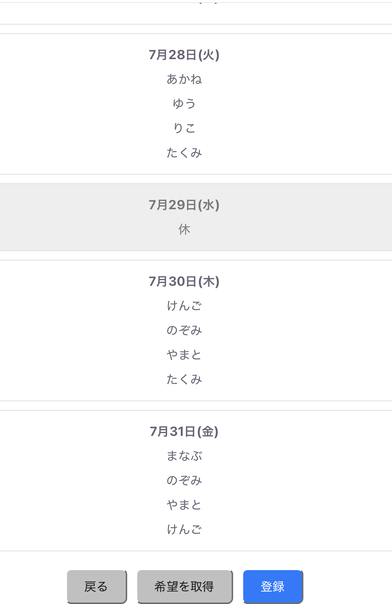

 

### 各日付のシフト保存
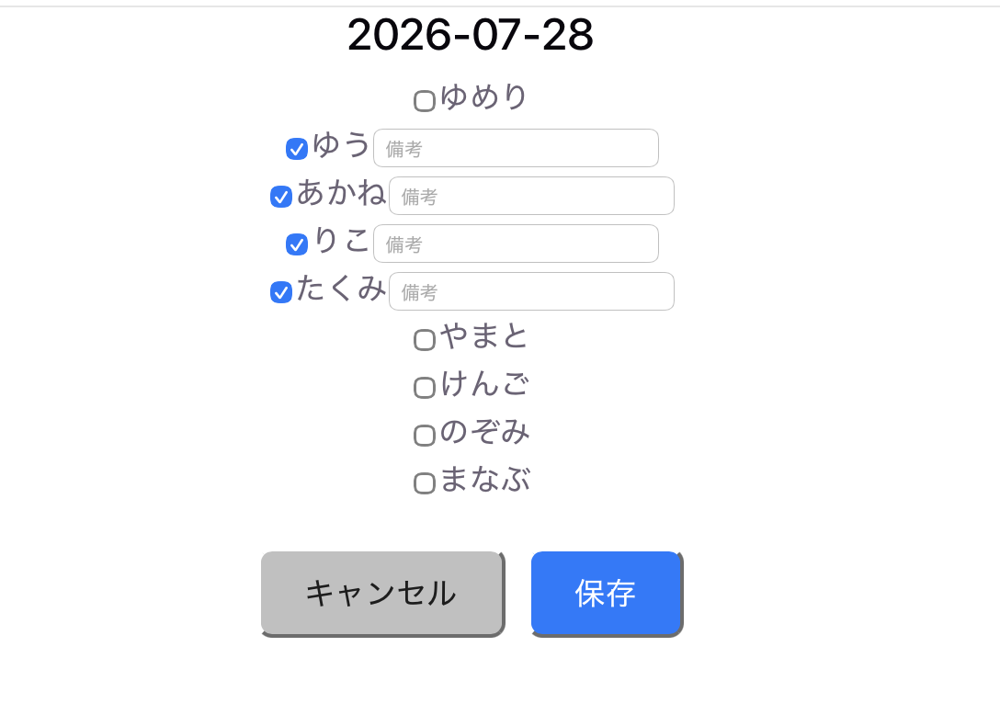

- スタッフ管理（管理者機能）

  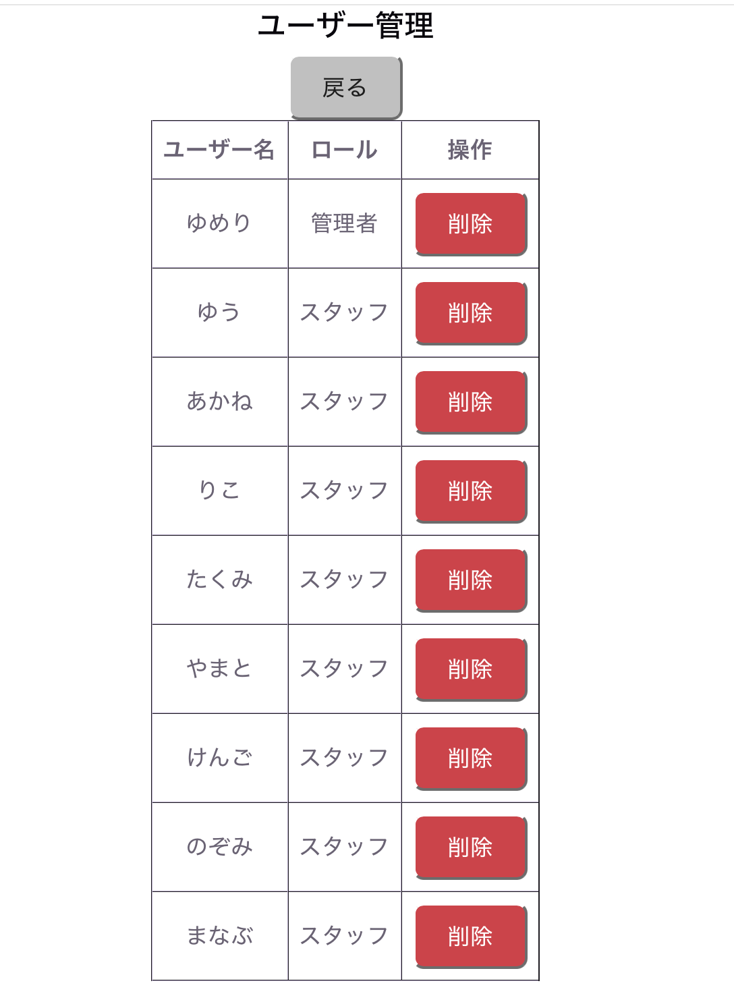

- 登録申請の許可・却下（管理者機能）

管理者がユーザー登録申請を許可した場合飲み、そのユーザーが登録されます。

  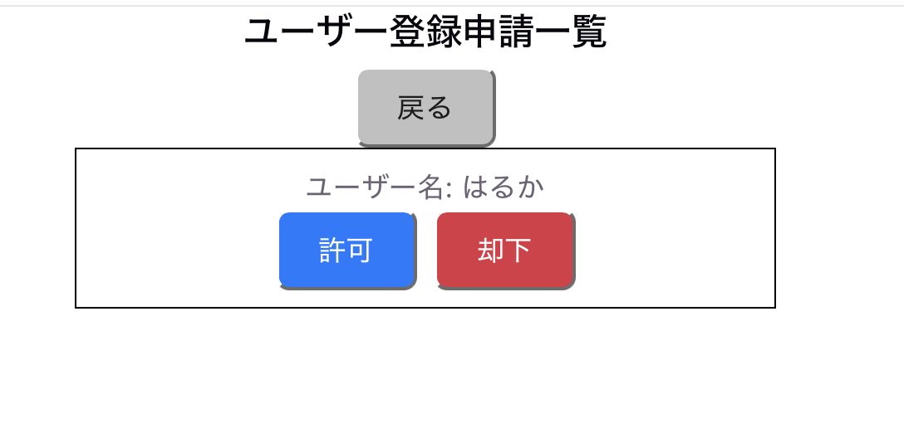

- シフト希望提出（スタッフ用機能）

期間内の日付から自分が出勤可能な日を選んで、シフト希望を提出することができます。備考を追加することも可能です。

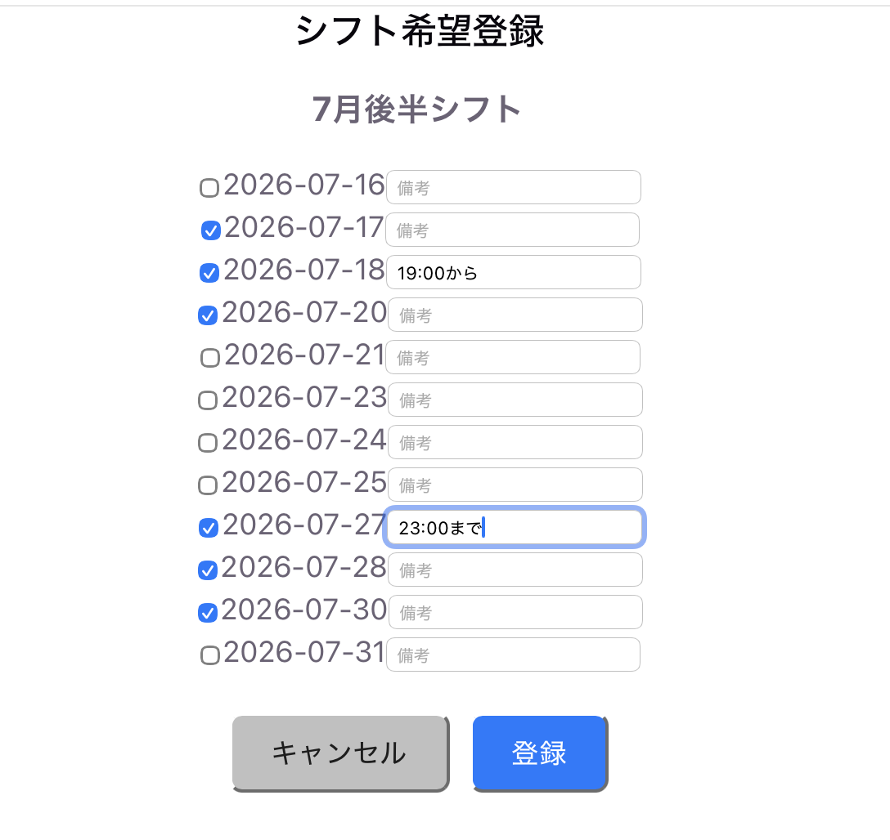

- シフト確認（スタッフ用機能）

確定したシフトを確認すうことができます。

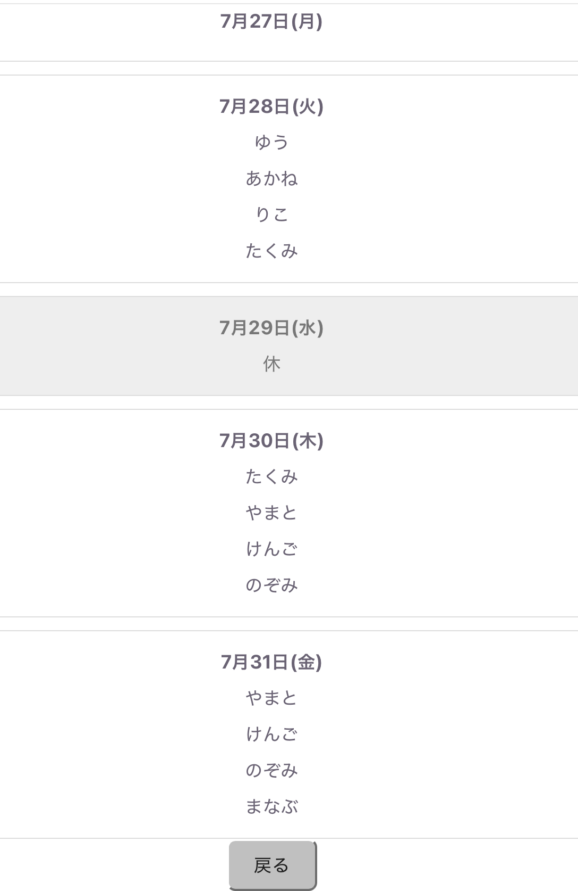
